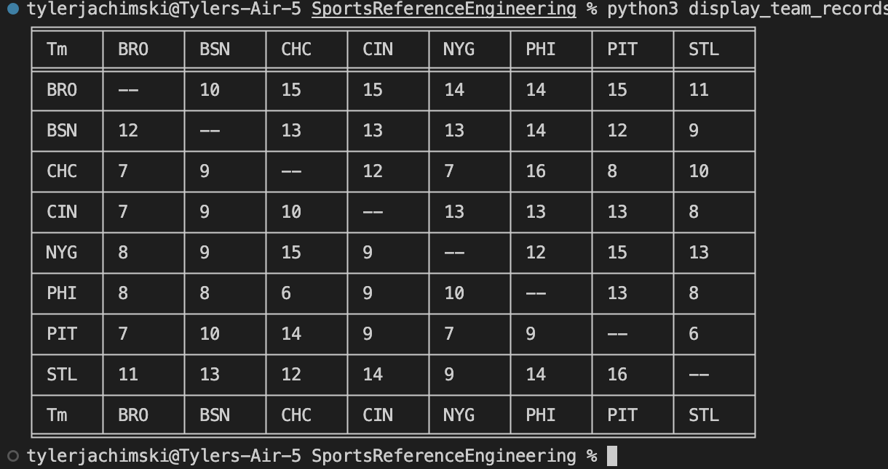

# Sports Reference Engineering Internship Coding Solution

This is the README.md file explaining the solution to the coding question for the Sports Reference Engineering Internship position.

## How to Run the Program
First, ensure you have the tabulate package installed for Python 3 in order to properly view the table generated. This can be done by typing the following in the terminal:
```
$ pip3 install tabulate
```

Once this package is installed, you can run the program by typing the following in the terminal:
```
$ python3 display_team_records.py
```

From here, you should be able to see the table generated by the program of teams' wins and losses against each other.

## Explanation of Code
The data of the teams' records is stored in a JSON file, labeled team_record.json in this case. This data is loaded as a dictionary using the following code:
```
data = open('team_record.json')
records = json.load(data)
```

When loaded in, the keys of this dictionary are the abbreivations of each team. The values of each of the keys are dictionaries containing the remaining teams as keys whose values are also dictionaries containing the wins and losses as keys, and the numerical values as their values. A list of the teams to sort through and generate the final table is then created by using the keys from this dictionary, done using the following line:
```
teams = list(records.keys())
```

Next, two empty lists are created. One named winsList is used to contain one team's wins against each other, and the other, named overallRecord, contains lists of all the teams' records. These are declared as follows:
```
overallRecord = []
winsList = []
```

Now, the records are ready to be sorted through. Two loops were necessary to read in all of the data. The first loop searches for each team in the JSON data read in, and the nested second loop searches for the remaining teams to record the head-to-head records. The code for these loops is as follows:
```
for i in teams:
    winsList.append(i)
    for j in teams:
        if (records.get(i).get(j) != None):
            winsList.append(records.get(i).get(j).get('W'))
        else:
            winsList.append("--")
    overallRecord.append(winsList.copy())
    winsList.clear()
```

First, the winsList list appends the current team name to the beginning of the list for table formatting purposes. Then, the current team loops through the list of every other team to search for their wins. This nested loop checks to ensure that the current team is not checking a record against itself. I accomplished this by searching for the value of the corresponding team key from the outer loop, and then searching the value of this key for the key of the team being searched for in the inner loop. If this value does not equal None, then a record does exist against this team, and the value of the win is accomplished searching as previously mentioned, and then searching for the value corresponding to the key "W", which is then appended to the winsList list. Otherwise, the value "--" is appended to the winsList list to designate that there is no record. After this inner loop has concluded, a copy of the current wins list for the team is appended to the overallRecord list to prevent mutations, and then the current winsList is cleared to be reused when looping again. This loop runs in O(n^2) time, which is the run time of the program.


After succesfully looping through, the teams list is modified to append "Tm" to the beginning for table formatting purposes. This is done through the following code:
```
teams.insert(0, "Tm")
overallRecord.append(teams)
```

The table is then displayed to the terminal using the tabulate package in Python. The parameters take in the list of lists of teams wins as the data, uses the updated list of teams as the headers, and is styled using "fancy_grid" to neatly display the data in tabular form. This is done using the following code:
```
print(tabulate(overallRecord, headers=teams, tablefmt="fancy_grid"))
```

The output should appear as follows


>Table of team head to head records

Finally, the JSON data file is closed by using:
```
data.close()
```